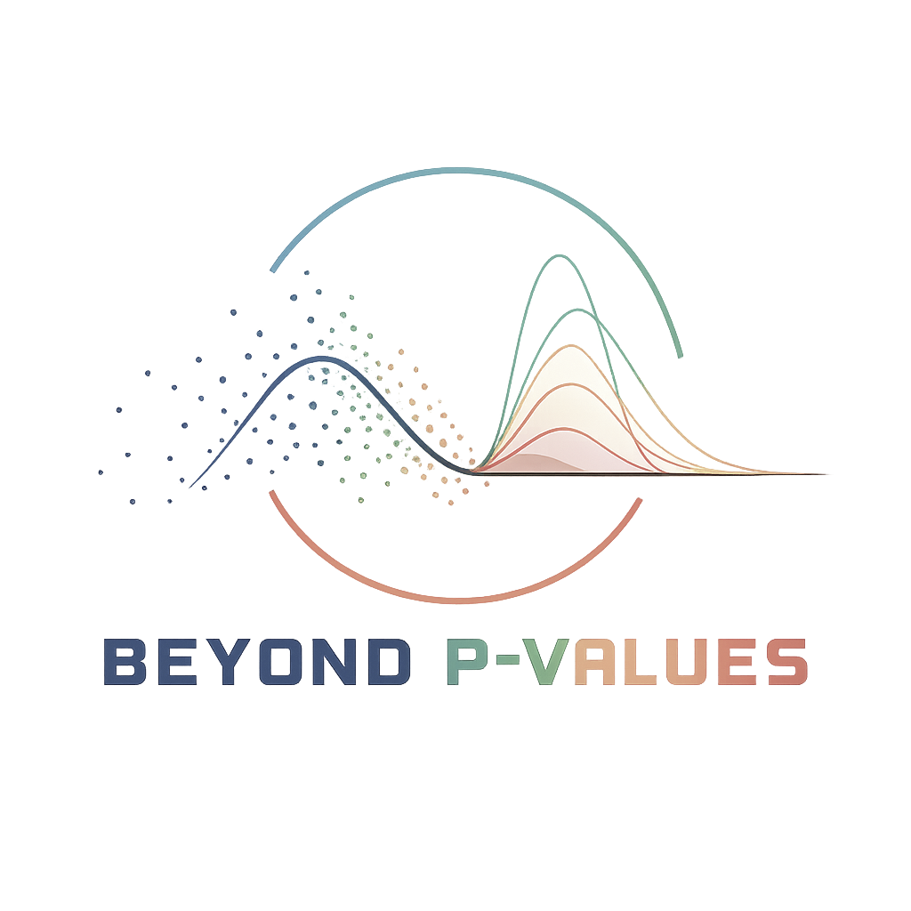

---
hide:
  - navigation
  - toc
title: Beyond p-values — Hub für bayesianische Statistik
---

<section class="bp-hero">
  

    

       Workshops · Methoden · Werkzeuge
      <h1>Jenseits des p-Werts. Bayesianisch denken.</h1>
      

        Bessere Antworten als „signifikant oder nicht": Effektgrößen, Präzision und
        bayesianische Inferenz — verständlich erklärt, im Browser zum Mitmachen.
      

      

        <a class="bp-btn bp-btn--primary" href="workshops/">Workshops entdecken →</a>
        <a class="bp-btn bp-btn--ghost" href="fragen/">Mit deiner Frage starten</a>
      

    

    

      
    

  

</section>

  

    61&nbsp;%
    Falsch-positiv-Rate, wenn fragwürdige Forschungspraktiken zusammenkommen <em>(Simmons et&nbsp;al., 2011)</em>.
  

  

    3
    interaktive Workshops — vollständig im Browser, im eigenen Tempo oder geführt.
  

  

    {{ workshops.thinking.chapters_count + workshops.power.chapters_count + workshops.reliability.chapters_count }}
    Kapitel mit Theorie und interaktiven Beispielen am SmartRail-Szenario.
  

  

    2015
    verzichtet <em>Basic and Applied Social Psychology</em> als erstes Journal vollständig auf p-Werte.
  

  

    Überblick
    <h2>Drei Wege ins Material</h2>
    

      Strukturiert über Workshops, themenzentriert über Fragen, vertieft über die
      Methoden-Seiten — wähle den Einstieg, der zu dir passt.
    

  

  <a class="bp-section-head__link" href="ueber/">Mehr über das Projekt →</a>

  <a class="bp-bento__cell x4 y2 tone-navy" href="workshops/">
    ▶
    

      <h3>Workshops — strukturiert lernen</h3>
      

        Drei Workshops mit insgesamt {{ workshops.thinking.chapters_count + workshops.power.chapters_count + workshops.reliability.chapters_count }} Kapiteln. Vollständig im Browser — im eigenen Tempo
        oder als gebuchter Live-Workshop für dein Team.
      

    

  </a>

  <a class="bp-bento__cell x2 tone-coral" href="fragen/">
    ?
    <h3>Fragen — themenzentriert</h3>
    
Klick auf deine Frage und springe direkt ins passende Kapitel.

  </a>

  <a class="bp-bento__cell x2" href="methoden/p-werte/">
    ⚠
    <h3>Probleme des p-Werts</h3>
    
Sieben verbreitete Fehlannahmen — kompakt erklärt.

  </a>

  <a class="bp-bento__cell x3 tone-teal" href="ressourcen/tools/">
    ⚙
    <h3>Tools & Software</h3>
    
Bayes-Analysen mit JASP, Jamovi, brms und PyMC — von Klick-GUI bis Code.

  </a>

  <a class="bp-bento__cell x3 tone-sand">
    ✦
    

      „The earth is round (p &lt; .05)."
      
— Jacob Cohen, 1994

    

  </a>

  <a class="bp-bento__cell x2" href="methoden/effektgroessen/">
    d
    <h3>Effektgrößen</h3>
    
Cohen's d, Hedges' g, η² — verstehen, einordnen, berichten.

  </a>

  <a class="bp-bento__cell x2" href="methoden/stichproben/">
    N
    <h3>Stichproben & Präzision</h3>
    
Wie viele Probanden brauchst du wirklich? Simulation statt Daumenregel.

  </a>

  <a class="bp-bento__cell x2" href="ressourcen/literatur/">
    📚
    <h3>Literatur</h3>
    
Kuratierte Bücher, Reviews und Schlüssel-Papers.

  </a>

  

    Workshops
    <h2>Drei Lernpfade — zwei Wege</h2>
    

      Jeder Workshop läuft vollständig im Browser (Python via Shinylive — keine Installation).
      Im eigenen Tempo ist alles kostenfrei zugänglich; geführte Sessions für dein Team
      buchst du über uns.
    

  

  <a class="bp-section-head__link" href="workshops/">Alle Workshops →</a>

  

    
    
    <a class="bp-card" href="{{ w.slug }}/" style="text-decoration:none;color:inherit;">
      {{ w.number }}
      {{ w.eyebrow }}
      <h3 class="bp-card__title">{{ w.title }}</h3>
      
{{ w.tagline }}

      

        📂 {{ w.chapters_count }} Kapitel
        ⏱ {{ w.duration_self }} self · {{ w.duration_guided }} geführt
      

    </a>
    

    <a class="bp-card" href="workshops/">
      04
      Train-the-Trainer
      <h3 class="bp-card__title">Multiplikator:innen-Programm</h3>
      

        Bringe die Methodenwende an deine Hochschule oder Klinik — als zertifizierte
        Multiplikator:in mit fertigem Curriculum und Materialien.
      

      

        👥 LehrendeIn Planung
      

    </a>

  

  

    Fragen
    <h2>Starte mit deiner Frage</h2>
    

      Statt Methoden-Kapitel zu durchsuchen, wähle eine konkrete Frage und springe direkt
      ins passende Workshop-Kapitel.
    

  

  <a class="bp-section-head__link" href="fragen/">Alle Fragen →</a>

  

    
    <a class="bp-card" href="fragen/#{{ q.key }}">
      {{ q.icon }} &nbsp; Frage
      <h3 class="bp-card__title">{{ q.title }}</h3>
      
{{ q.lead }}

      

        🔗 {{ q.links | length }} Verweise
      

    </a>
    
  

  

    Methoden
    <h2>Die drei methodischen Säulen</h2>
    

      Drei Fragen, die jede empirische Studie beantworten sollte — und die Werkzeuge,
      mit denen sie sich tatsächlich beantworten lassen.
    

  

  <a class="bp-section-head__link" href="methoden/">Alle Methoden →</a>

  <a class="bp-pillar" href="methoden/effektgroessen/" style="text-decoration:none;color:inherit;display:block;">
    
FRAGE 01

    <h3>Gibt es einen Effekt — und wie groß?</h3>
    

      Antwort: <strong>Effekte und Effektgrößen.</strong> Cohen's d, Hedges' g oder schlicht
      Mittelwertsdifferenzen liefern die Größe direkt — der p-Wert kann das prinzipbedingt nicht.
    

  </a>

  <a class="bp-pillar" href="methoden/stichproben/" style="text-decoration:none;color:inherit;display:block;">
    
FRAGE 02

    <h3>Wie verlässlich ist die Schätzung?</h3>
    

      Antwort: <strong>Stichprobenqualität und -größe.</strong> Repräsentativität, Drop-outs und
      Präzisions-Simulationen sagen mehr aus als jede pauschale Power-Tabelle.
    

  </a>

  <a class="bp-pillar" href="methoden/bayesian/" style="text-decoration:none;color:inherit;display:block;">
    
FRAGE 03

    <h3>Was sagen die Daten über die Hypothese?</h3>
    

      Antwort: <strong>Bayesianische Datenanalyse.</strong> Wahrscheinlichkeiten für Hypothesen,
      Bayes-Faktoren und sequenzielles Lernen — statt binärem Sieger-Verlierer-Schema.
    

  </a>

  

    Ressourcen
    <h2>Software, Literatur und Talks</h2>
    

      Eine kuratierte Auswahl — Werkzeuge und Quellen, mit denen wir selbst arbeiten und
      die wir guten Gewissens weiterempfehlen.
    

  

  <a class="bp-section-head__link" href="ressourcen/">Alle Ressourcen →</a>

  

    <a class="bp-card" href="https://jasp-stats.org/" target="_blank" rel="noopener">
      Software · Open Source
      <h3 class="bp-card__title">JASP</h3>
      

        Statistiksoftware mit grafischer Oberfläche und erstklassiger Bayes-Implementierung —
        niederschwellig für Lehre und eigene Analysen.
      

      
🪟 Win🍎 Mac🐧 Linux

    </a>

    <a class="bp-card" href="https://www.jamovi.org/" target="_blank" rel="noopener">
      Software · Open Source
      <h3 class="bp-card__title">Jamovi</h3>
      

        Modulare Plattform auf R-Basis. Klassische und bayesianische Tests stehen
        nebeneinander, erweiterbar mit zahlreichen Modulen.
      

      
🪟 Win🍎 Mac🐧 Linux

    </a>

    <a class="bp-card" href="ressourcen/literatur/">
      Buch
      <h3 class="bp-card__title">Statistical Rethinking</h3>
      

        Richard McElreaths Klassiker — der wahrscheinlich beste Einstieg in bayesianisches
        Denken überhaupt. Inkl. frei verfügbarer Vorlesungsreihe.
      

      
📘 612 Seiten🎥 Vorlesungsreihe

    </a>

    <a class="bp-card" href="ressourcen/literatur/">
      Paper
      <h3 class="bp-card__title">ASA Statement on p-Values</h3>
      

        Wasserstein &amp; Lazar (2016) — der offizielle Konsens der American Statistical
        Association zur Auslegung des p-Werts.
      

      
📄 6 Seiten🔗 DOI

    </a>

    <a class="bp-card" href="ressourcen/videos/">
      Video
      <h3 class="bp-card__title">Vorlesungsreihe McElreath</h3>
      

        Komplette „Statistical Rethinking"-Vorlesung — frei auf YouTube. Ideal als
        Begleitung zum Buch oder als eigenständiger Lernpfad.
      

      
🎥 20 Folgen⏱ 30+ h

    </a>

    <a class="bp-card" href="ressourcen/journals/">
      Journal
      <h3 class="bp-card__title">BASP — Publizieren ohne p-Werte</h3>
      

        <em>Basic and Applied Social Psychology</em> verzichtet seit 2015 vollständig auf
        p-Werte — Blaupause für eine neue Berichtskultur.
      

      
📰 Quarterly🔗 Editorial

    </a>

  

  

    <h3>Bleib informiert — kein Spam, nur Substanz.</h3>
    

      Quartalsweiser Newsletter mit neuen Workshops, Veröffentlichungen und konkreten
      Beispielen aus der Arbeit am Projekt.
    

    <form>
      <input type="email" placeholder="deine@email.de" aria-label="E-Mail-Adresse" required>
      <button type="submit" class="bp-btn bp-btn--primary">Anmelden</button>
    </form>
    <small>Jederzeit abbestellbar. Wir geben deine Adresse nicht weiter.</small>
  

  

    

      <strong style="font-size: 1.1rem; color: #fff;">Du willst aktiv mitwirken?</strong> 
      Wir suchen Kooperationen mit Hochschulen, Kliniken, Verlagen und Krankenkassen.
    

    <a class="bp-btn bp-btn--ghost" href="kontakt/" style="margin-top: 1rem;">Kontakt aufnehmen →</a>
  

