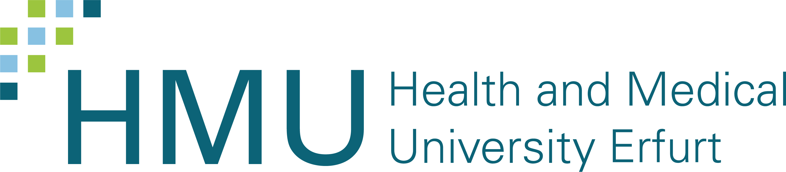
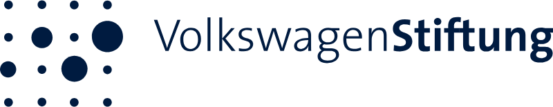

# Partner & Förderer

Das Projekt lebt davon, dass viele Akteure mitziehen, von Hochschulen über Fachverlage bis
zu Krankenkassen. Hier dokumentieren wir, welche Kooperationen wir aufbauen wollen. Bisher
ist noch nichts angefragt, alle genannten Partner sind **geplant**.

## Trägerschaft & Förderung

  

    In Trägerschaft
    
  

  

    Gefördert durch
    
  

!!! info "Förderhinweis"

    Dieses Vorhaben wird von der **VolkswagenStiftung** im Rahmen der Förderlinie
    „Pioniervorhaben" gefördert. Träger ist die HMU Health and Medical University
    Erfurt. Die Verantwortung für den Inhalt dieser Veröffentlichung liegt bei den
    Autorinnen und Autoren.

## Wissenschaftliche Partner

  
ZPID Trier<small>geplant</small>

  
DGPs-Methodengruppe<small>geplant</small>

  
Weitere Universitäten<small>geplant</small>

## Verlage

  
Hogrefe<small>geplant</small>

  
Springer Nature<small>geplant</small>

  
Beltz<small>geplant</small>

## Praxispartner

  
Krankenkassen<small>geplant</small>

  
Klinik-Kooperationen<small>geplant</small>

  
Harding-Zentrum<small>Vorbild</small>

  Wir suchen
  <h3>Werde Partner</h3>
  
Unsere Türen sind offen für Hochschulen, Forschungseinrichtungen, Fachverlage, Kliniken, Krankenkassen, Fachgesellschaften und einzelne Forschende, die die Methodenwende aktiv mittragen wollen. Schreib uns kurz, woran du interessiert bist.

  <a class="bp-btn bp-btn--primary" href="../../kontakt/" style="margin-top: 1rem;">Kontakt aufnehmen</a>

## Wirkungs-Berichte

Über die Laufzeit dokumentieren wir, welche konkreten Veränderungen wir mit welchem Partner
erreicht haben, von ersten p-freien Pilotartikeln bis zu dauerhaften Richtlinien-Anpassungen.

| Partner / Stakeholder            | Geplante Wirkung                                              | Status                                              |
|----------------------------------|---------------------------------------------------------------|-----------------------------------------------------|
| Hochschulen                      | Methodenwissen in Curricula                                   | Geplant |
| Verlage / Editorials             | Veröffentlichungs-Richtlinien ohne p-Zwang                    | Geplant |
| Krankenkassen                    | Faktenbox-artige Information für Behandelte                   | Geplant |
| Fachgesellschaften               | Statements und Methoden-Empfehlungen                          | Geplant |
| Lehrende (Train-the-Trainer)     | Train-the-Trainer-Curriculum mit Materialien                  | Geplant |

Sobald konkrete Vereinbarungen unterschrieben sind, ergänzen wir hier Logo, Beschreibung und
Status.
